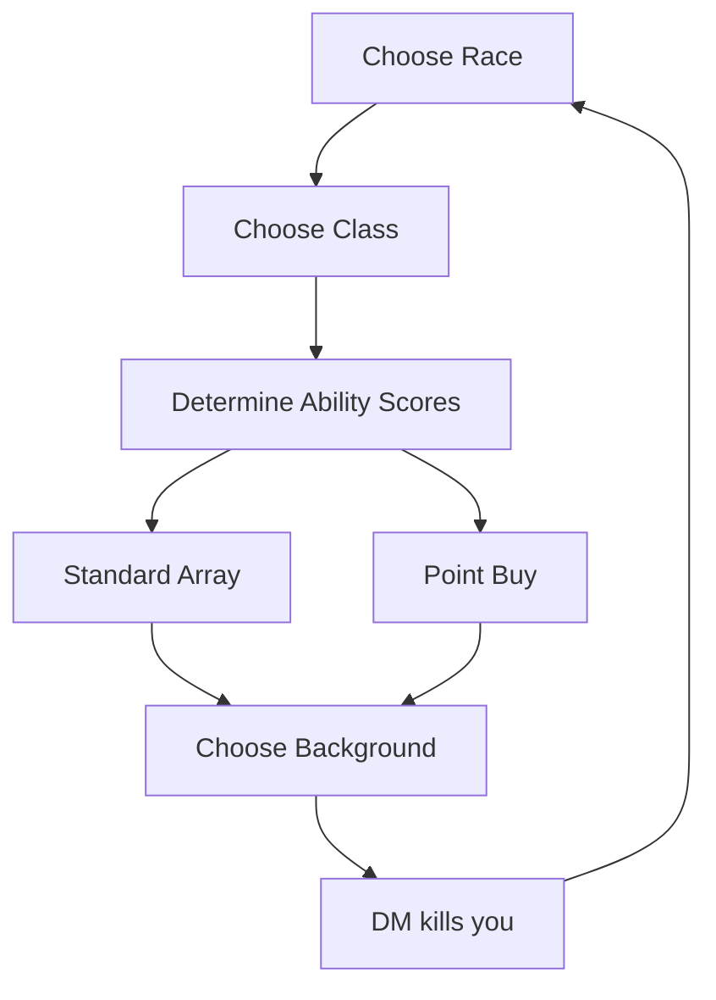

This diagram shows the general process in making a character in Dungeons & Dragons 5th Edition, with a joke at the end.
In D&D5e, you choose a race such us dwarf, elf, or human. Proceeding to class such as cleric, fighter, rogue, or wizard.
Ability scores can be generated in a variety of ways, the two primary methods being the standard array or point buy.
And finally ending off with your character's background.
After starting the game, the Dungeon Master may or may not kill your character, thus restarting the process.
