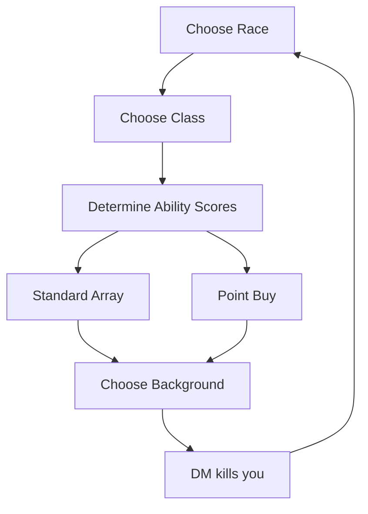

```mermaid
graph TD;
    A[Choose Race] --> B[Choose Class];
    B --> C[Determine Ability Scores];
    C --> D[Standard Array];
    C --> E[Point Buy];
    D --> F[Choose Background];
    E --> F;
    F --> G[DM kills you];
    G --> A;
```
This diagram shows the general process in making a character in Dungeons & Dragons 5th Edition 2014, with a joke at the end.
